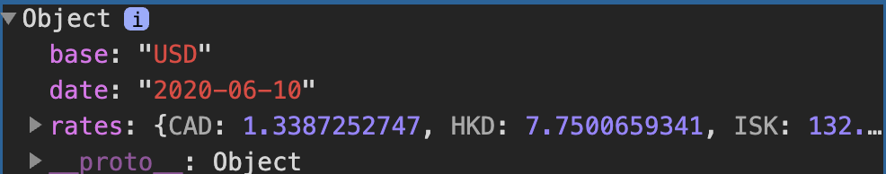

<!-- https://fonts.google.com/specimen/PT+Sans?query=PT+Sans&selection.family=PT+Sans:ital,wght@0,400;0,700;1,400;1,700 -->

<!-- https://getbootstrap.com/docs/ -->

<!-- https://bootstrap-table.com/docs/getting-started/introduction/ -->

<!-- https://fontawesome.com/how-to-use/on-the-web/referencing-icons/basic-use -->

<!-- https://moment.github.io/luxon/ -->

<!-- http://docs.mathjax.org/ -->

<!-- http://docs.mathjax.org/en/latest/options/output/chtml.html?highlight=displayAlign#the-configuration-block -->

<!-- https://github.com/verlok/vanilla-lazyload -->

<!-- https://github.com/davidjbradshaw/iframe-resizer -->

<!-- https://github.com/scratchblocks/scratchblocks/releases -->

<!-- https://mermaid-js.github.io/ -->

<!-- https://github.com/twitter/twemoji -->

# Lecture 5

* [JavaScript](#javascript)

* [Events](#events)

* [Variables](#variables)

* [querySelector](#queryselector)

* [DOM Manipulation](#dom-manipulation)

    * [JavaScript Console](#javascript-console)
    * [Arrow Functions](#arrow-functions)
    * [TODO List](#todo-list)

* [Intervals](#intervals)

* [Local Storage](#local-storage)

* [APIs](#apis)

    * [JavaScript Objects](#javascript-objects)
    * [Currency Exchange](#currency-exchange)

## JavaScript

**JS简单使用**  
回想一下，在大多数在线交互中，我们有一个客户端/用户向服务器发送一个HTTP请求，服务器返回一个HTTP响应。到目前为止，我们使用Django编写的所有Python代码都是在一个服务器上运行的。JavaScript将允许我们在客户端运行代码，这意味着在运行时不需要与服务器交互，从而使我们的网站变得更具交互性。
为了向我们的页面添加一些JavaScript，我们可以在HTML页面的某个地方添加一对`<script>`
标签向浏览器发出信号，表明我们在两个标签之间编写的任何内容都是我们希望在用户访问我们的网站时执行的JavaScript代码。我们的第一个程序可能看起来像这样：

```javascript
alert('Hello, world!');
```

JavaScript中的`alert`函数向用户显示一条消息，然后用户可以取消该消息。显示这将在哪里
适合一个实际的HTML文档，这里有一个简单的JavaScript页面的例子：

```html
<!DOCTYPE html>
<html lang="en">
<head>
	<title>Hello</title>
	<script>
		alert('Hello, world!');
	</script>
</head>
<body>
<h1>Hello!</h1>
</body>
</html>
```


## Events

JavaScript对web编程很有帮助的一个特性就是它
支持 [Event-Driven Programming](https://medium.com/@vsvaibhav2016/introduction-to-event-driven-programming-28161b79c223).

事件驱动编程是一种以检测事件和应该检测的动作为中心的编程范式
在检测到事件时应该采取的行动。

事件几乎可以是任何事情，包括单击按钮、移动光标、输入响应或
页面加载。几乎用户与网页交互所做的一切都可以被认为是一个事件。在
在JavaScript中，我们使用[事件监听器](https://www.w3schools.com/js/js_htmldom_eventlistener.asp)
等待确定事件发生，然后执行一些代码。

让我们从将JavaScript转换为[函数](https://www.w3schools.com/js/js_functions.asp)
开始。被称为 `hello`:

```javascript
function hello() {
    alert('Hello, world!')
}
```

现在，让我们在按钮被单击时运行这个函数。为此，我们将在中创建一个HTML按钮
带有`onclick`属性的页面，当按钮出现时，它会告诉浏览器应该发生什么
点击:

```
<button onclick="hello()">Click Here</button>
```

这些更改允许我们等待JavaScript代码的一部分，直到某个事件发生。

## Variables

JavaScript是一种编程语言，就像Python、C或你以前使用过的任何其他语言一样
和其他语言有很多相同的特性，包括变量。我们可以用三个关键字来赋值
JavaScript中的值：

* `var`: 用于全局定义变量

```
var age = 20;
```

* `let`: 用于定义一个变量，限定在当前块内，如函数或循环

```
let counter = 1;
```

* `const`: 用于定义一个不会改变的值,常量;

```
const PI = 3.14;
```

举个例子，让我们看一个记录计数器的页面，看看如何使用变量：

```html
<!DOCTYPE html>
<html lang="en">
<head>
	<title>Count</title>
	<script>
		let counter = 0;

		function () {
			counter++;
			alert(counter);
		}
	</script>
</head>
<body>
<h1>Hello</h1>
<button onclick="count)">Count</button>
</body>
</html>
```


## `querySelector`

除了允许我们通过警告来显示消息，JavaScript还允许我们更改页面上的元素。
为了做到这一点，我们必须首先引入一个名为`document.querySelector`的函数。这个函数搜索and
返回DOM中的元素。例如，我们会使用：

```javascript
let heading = document.querySelector('h1');
```

提取标题。然后，为了操作我们最近发现的元素，我们可以更改它的`innerHTML`属性：

```
heading.innerHTML = `Goodbye!`;
```

就像在Python中一样，我们也可以在中利用[conditions](https://www.w3schools.com/js/js_if_else.asp)
JavaScript。例如，让我们说，而不是总是将我们的header更改为`Goodbye！`，我们希望切换回和
在`Hello!`和`再见！`我们的页面可能会像下面这样。注意，在JavaScript中，
我们使用`===`作为两个元素之间的更强的比较，这也检查了两个对象的类型是否相同。我们
通常在可能的情况下使用`===`。

```html
<!DOCTYPE html>
<html lang="en">
<head>
	<title>Count</title>
	<script>
		function hello() {
			const header = document.querySelector('h1');
			if (header.innerHTML === 'Hello!') {
				header.innerHTML = 'GoodBye!';
			} else {
				header.innerHTML = 'Hello';
			}
		}
	</script>
</head>
<body>
<h1>Hello!</h1>
<button onclick="hello()">Click Here</button>
</body>
</html>
```


## DOM Manipulation

让我们使用这种DOM操作的思想来改进计数器页面：

```html
<!DOCTYPE html>
<html lang="en">
<head>
	<title>Count</title>
	<script>
		let counter;

		function count() {
			counter++;
			document.querySelector('h1').innerHTML = counter;
		}
	</script>
</head>
<body>
<h1>0</h1>
<button onclick="count()">Count</button>
</body>
</html>
```


我们可以让这个页面变得更有趣：每当计数器的值达到10的倍数时，就显示一个警告框。在
在这个警告中，我们想要格式化一个字符串来自定义消息，这在JavaScript中我们可以做到
使用[模板字面量](https://developer.mozilla.org/en-US/docs/Web/JavaScript/Reference/Template_literals)。模板
字面量要求在整个表达式周围有反引号（`` ` ``），并且在any周围有一个$和大括号
替换。例如，我们改变计数函数

```javascript
function count() {
    let counter;

    function count() {
        counter++;
        if (counter % 10 === 0) {
            alert(`Count is now ${counter}`)
        }
    }
}
```


现在，让我们来看看改进这个页面设计的一些方法。首先，就像我们尽量避免内嵌一样
用CSS设置样式，我们希望尽可能避免内联JavaScript。我们可以在我们的反例中做到这一点
添加一行更改页面上按钮的`onclick`属性的脚本，并删除`onclick`
属性从`button`标签中移除。

```html
document.querySelector('button').onclick = count;
```

需要注意的是，我们并没有通过添加括号来调用`count`函数
之后，而只是命名函数。这指定了我们只希望在按钮按钮时调用这个函数
点击。这是可行的，因为像Python一样，JavaScript支持函数式编程，所以函数可以被视为
自己的价值观。

仅仅上面的改变是不够的，我们可以通过查看页面和浏览器的控制台来看到：


这个错误出现是因为当JavaScript使用‘ document.querySelector（’button‘） ’搜索元素时，它没有
找到任何东西。这是因为加载页面需要一点时间，并且我们的JavaScript代码在
按钮被渲染了。为了解决这个问题，我们可以指定代码仅在页面加载后运行
[addEventListener](https://www.w3schools.com/jsref/met_document_addeventlistener.asp)函数。这个函数需要
有两个参数：

1. 要监听的事件（例如：" click' '）
2. 当检测到事件时运行的函数（例如：上面的`hello`）

我们可以使用这个函数只在所有内容加载后运行代码：

```javascript
document.addEventListener('DOMContentLoaded', function () {
    //todo
})
```

在上面的例子中，我们使用了[匿名](https://www.w3schools.com/js/js_function_definition.asp)函数，它
是一个从不给出名字的函数。综上所述，我们的JavaScript现在看起来是这样的：

```javascript
let counter = 0;

function count() {
    document.querySelector('h1').innerHTML = counter;
    if (counter % 10 === 0) {
        alert(`Count is now ${counter}`);
    }
}

document.addEventListener('DOMContentLoaded', function () {
    document.querySelector('button').onclick = count;
})
```

我们可以改进设计的另一种方法是将JavaScript移到单独的文件中。我们这样做的方法是非常
类似于我们将CSS放在单独的文件中进行样式设置：

1. 将所有JavaScript代码写在一个以`.js`结尾的单独文件中，也许是`index.js`.
2. 给`<script>`标签添加一个`src`属性，指向这个新文件。

对于我们的计数器页面，我们可以有一个名为`counter.html`的文件，看起来像这样：

```
<!DOCTYPE html>
<html lang="en">
    <head>
        <title>Count</title>
        <script src="counter.js"></script>
    </head>
    <body>
        <h1>0</h1>
        <button>Count</button>
    </body>
</html>
```

还有一个名为`counter.js`的文件，它看起来像这样：

```
let counter = 0;
            
function count() {
    counter++;
    document.querySelector('h1').innerHTML = counter;
    
    if (counter % 10 === 0) {
        alert(`Count is now ${counter}`)
    }
}

document.addEventListener('DOMContentLoaded', function() {
    document.querySelector('button').onclick = count;
});
```

将JavaScript放在一个单独的文件中是有用的，原因如下：

*视觉吸引力：我们的个人HTML和JavaScript文件变得更可读。

* HTML文件之间的访问：现在我们可以有多个HTML文件，所有共享相同的JavaScript。
  *协作：我们现在可以轻松地让一个人在JavaScript上工作，而另一个人在HTML上工作。
  *导入：我们可以导入别人已经写好的JavaScript库。为
  example [Bootstrap](https://getbootstrap.com/docs/4.5/getting-started/introduction/#js)有自己的JavaScript
  你可以包含的库，使你的网站更具交互性。

让我们从另一个更具交互性的页面示例开始。下面，我们将创建一个页面，其中
用户可以输入自己的名字来获取自定义问候语。

```html
<!DOCTYPE html>
<html lang="en">
<head>
	<title>Hello</title>
	<script>
		document.addEventListener('DOMContentLoaded', function () {
			document.querySelector('form').onsubmit = function () {
				const name = document.querySelector('#name').value;
				alert(`Hello,${name}`);
			};
		});
	</script>
</head>
<body>
<form>
	<input autofocus id="name" type="text" placeholder="Name">
	<input type="submit">
</form>
</body>
</html>
```


关于上面页面的一些注意事项：

*我们在`name`输入框中使用`autofocus`字段来表示应该尽快在该输入框中设置游标
当页面加载完成时。
*我们在`document. name`中使用`#name`。` querySelector`来查找`id`为`name`的元素。我们同样可以使用它们
选择器在这个函数中，就像在CSS中一样。
*我们使用输入字段的`value`属性来查找当前输入的内容。

我们不仅可以使用JavaScript将HTML添加到页面中，我们还可以更改页面的样式！在页面中
下面，我们用按钮来改变标题的颜色。

```html
<!DOCTYPE html>
<html lang="en">
<head>
	<title>colors</title>
	<script>
		document.addEventListener('DOMContentLoaded', function () {
			document.querySelectorAll('button').forEach(function (button) {
				button.onclick = function () {
					document.querySelector('#hello').style.color =
							button.dataset.color;
				}
			});
		});
	</script>
</head>
<body>
<h1 id="hello">Hello</h1>
<!--  使用数据绑定-->
<button data-color="red">Red</button>
<button data-color="blue">Blue</button>
<button data-color="Green">Green</button>
</button>
</body>
</html>
```


上一页的一些注意事项：

*我们使用`style. js `来改变元素的样式。事物的属性。
*我们使用`data- something `属性将数据分配给HTML元素。稍后我们可以在JavaScript中访问该数据
使用元素的`dataset`属性。
*我们使用`querySelectorAll`函数来获得一个[节点列表](https://www.w3schools.com/js/js_htmldom_nodelist.asp)
类似于Python列表或JavaScript[数组](https://www.w3schools.com/js/js_arrays.asp)，其中所有元素
匹配查询。

* JavaScript中的[forEach](https://www.w3schools.com/jsref/jsref_foreach.asp)函数接受另一个函数，和
  将该函数应用于列表或数组中的每个元素。

### JavaScript Console

控制台是测试小段代码和调试的有用工具。你可以在其中编写和运行JavaScript代码
控制台，可以通过在web浏览器中检查元素然后点击`console`来找到它。(确切的
过程可能会因浏览器而异。)一个有用的调试工具是打印到控制台，你可以这么做
使用`console.log`函数。例如，在上面的`colors.html`页面中，我可以添加以下代码：

```javascript
console.log(document.querySelectorAll('button'));
```

这会在控制台中显示：


### Arrow Functions

除了我们已经见过的传统函数表示法，JavaScript现在还提供了这样的能力
在我们有输入的地方使用[箭头函数](https://www.w3schools.com/js/js_arrow_function.asp)(或者括号当
没有输入)后面是`=>`，然后是一些要运行的代码。例如，我们可以修改上面的脚本来使用
匿名箭头函数：

```javascript
// 箭头函数主要是this的引用不同;
document.addEventListener('DOMContentLoaded', () => {
    document.querySelectorAll('button').forEach((button => {
        button.onclick = () => {
            document.querySelector('#hello').style.color = button.dataset.color;
        }
    }));
})
```

也可以使用箭头命名函数，如下重写的count函数：

```javascript
count = () => {
    counter++;
    document.querySelector('h1').innerHTML = counter;

    if (counter % 10 === 0) {
        alert(`Count is now ${counter}`)
    }
}
```

为了了解可以使用的其他事件，让我们看看如何使用下拉菜单来实现我们的颜色转换器
菜单而不是三个单独的按钮。我们可以使用`onchange`属性来检测`select`元素的变化。在
在JavaScript中，[this](https://www.w3schools.com/js/js_this.asp)是一个根据上下文而变化的关键字
这是使用。在事件处理程序中，`this`指的是触发事件的对象。

```html
<!DOCTYPE html>
<html lang="en">
<head>
	<title>Colors</title>
	<script>document.addEventListener('DOMContentLoaded', function () {
		document.querySelector('select').onchange = function () {
			document.querySelector('#hello').style.color = this.value;
		}
	});
	</script>
</head>
<body>
<h1 id="hello">Hello</h1>
<select>
	<option value="black">Black</option>
	<option value="red">Red</option>
	<option value="blue">Blue</option>
	<option VALUE="green">Green</option>
</select>
</body>
</html>
```


我们还可以在JavaScript中检测到许多其他[事件](https://www.w3schools.com/js/js_events.asp)，包括
常见的有以下几个：

* `onclick`
* `onmouseover`
* `onkeydown`
* `onkeyup`
* `onload`
* `onblur`
* …

### TODO List

把我们在这节课中学到的一些东西放在一起，让我们来做一个待办事项清单
JavaScript。我们将从编写页面的HTML布局开始。注意下面我们是如何为无序列表留出空间的，
但我们还没有向它添加任何东西。还请注意，我们添加了一个链接到`tasks.js`，我们将在其中编写JavaScript。

```html
<!DOCTYPE html>
<html lang="en">
<head>
	<title>Tasks</title>
	<script></script>
</head>
<body>
<h1>Tasks</h1>
<ul id='tasks'>
	<form>
		<input id="task" placeholder="New Task" type="text">
		<input id="submit" type="submit">
	</form>
</ul>
</body>
</html>
```

现在，这是我们的代码，可以保存在`tasks.js`中。关于你将在下面看到的一些注意事项：

* 此代码与lecture中的代码略有不同。这里，我们只查询了我们的提交按钮和输入任务
  字段，并将这两个值存储在变量`submit`和`newTask`中。
* 我们可以通过将按钮的`disabled`属性设置为`false`/`true`来启用/禁用按钮。
* 在JavaScript中，我们使用 `Length`来查找字符串和数组等对象的长度。
* 在脚本的最后，我们添加了`return false`这一行。这防止了表单的默认提交
  包括重新加载当前页面或重定向到一个新的页面。
* 我们可以使用
  [createElement](https://www.w3schools.com/jsref/met_document_createelement.asp)函数。然后我们可以添加这些
  元素使用`append`函数添加到DOM中。

```javascript
//等待页面加载
document.addEventListener('DOMContentLoaded', function () {

    //选择提交按钮并输入稍后使用的内容
    const submit = document.querySelector('#submit');
    const newTask = document.querySelector('#task');

    // 默认禁用提交按钮：
    submit.disabled = true;

    // 监听输入框中的输入
    newTask.onkeyup = () => {
        if (newTask.value.length > 0) {
            submit.disabled = false;
        } else {
            submit.disabled = true;
        }
    }

    // 注意表格的提交
    document.querySelector('form').onsubmit = () => {

        // 查找用户刚刚提交的任务
        const task = newTask.value;

        // 为新任务创建一个列表项，并将任务添加到其中
        const li = document.createElement('li');
        li.innerHTML = task;

        // 向无序列表中添加新元素：
        document.querySelector('#tasks').append(li);

        // 清空输入字段：
        newTask.value = '';

        // 再次禁用提交按钮：
        submit.disabled = true;

        // 停止提交表单
        return false;
    }
});
```


## Intervals

除了指定函数在事件触发时运行外，还可以设置函数在set之后运行
时间量。例如，让我们返回到我们的计数器页面的脚本，并添加一个间隔，以便即使用户没有
点击任何东西，计数器每秒钟递增一次。要做到这一点，我们使用
[setInterval](https://www.w3schools.com/jsref/met_win_setinterval.asp)函数，它接受一个函数作为参数
要运行的，以及函数运行之间的时间间隔（单位为毫秒）。

```javascript
let counter = 0;

function count() {
    counter++;
    document.querySelector('h1').innerHTML = counter;
}

document.addEventListener('DOMContentLoaded', function () {
    document.querySelector('button').onclick = count;

    setInterval(count, 1000);
});
```


## Local Storage

到目前为止，我们所有的网站都需要注意的一点是，每次重新加载页面时，我们所有的信息都会丢失。
标题颜色变回黑色，计数器变回0，所有的任务都被擦除。有时这是
这是我们想要的，但其他时候，我们希望能够存储用户返回时可以使用的信息
网站。

一种方法是使用[本地存储](https://www.w3schools.com/jsref/prop_win_localstorage.asp)，或者
将信息存储在用户的网页浏览器上，以便我们以后访问。这些信息被存储为一组键值
对，几乎像一个Python字典。为了使用本地存储，我们将使用两个关键函数：

* `localStorage.getItem(key)`：此函数使用给定的键在本地存储中搜索条目，并返回
  与该键相关联的值。
* `localStorage。setItem(key, value)`：此函数在本地存储中设置和条目，将键与新关联
  价值。

让我们看看如何使用这些新函数来更新我们的计数器！在下面的代码中，

```javascript
//检查本地存储中是否已经有值
if (!localStorage.getItem('counter')) {

    // 如果没有，在本地存储中将计数器设置为0
    localStorage.setItem('counter', 0);
}

function count() {
    // 从本地存储中检索计数器值
    let counter = localStorage.getItem('counter');

    // 更新计数器
    counter++;
    document.querySelector('h1').innerHTML = counter;

    // 在本地存储中存储计数器
    localStorage.setItem('counter', counter);
}

document.addEventListener('DOMContentLoaded', function () {
    //  SEt指向本地存储中的当前值
    document.querySelector('h1').innerHTML = localStorage.getItem('counter');
    document.querySelector('button').onclick = count;
});
```

## APIs

### JavaScript Objects

[JavaScript对象](https://www.w3schools.com/js/js_objects.asp)在允许的情况下与Python字典非常相似
我们来存储键值对。例如，我可以创建一个表示哈利波特的JavaScript对象：

```javascript
let person = {
    first: 'Harry',
    last: 'Potter'
};
```

I can then access or change parts of this object using either bracket or dot notation:


One way in which JavaScript Objects are really useful is in transferring data from one site to another, particularly
when using [APIs](https://www.mulesoft.com/resources/api/what-is-an-api)

An API, or Application Programming Interface, is a structured form communication between two different applications.

For example, we may want our application to get information from Google Maps, Amazon, or some weather service. We can do
this by making calls to a service’s API, which will return structured data to us, often
in [JSON](https://www.w3schools.com/js/js_json_intro.asp) (JavaScript Object Notation) form. For example, a flight in
JSON form might look like this:

```json
{
    "origin": "New York",
    "destination": "London",
    "duration": 415
}
```

在上面的例子中，JSON中的值不一定只有字符串和数字。我们还可以存储列表，甚至其他JavaScript对象：

```json
{
    "origin": {
        "city": "New York",
        "code": "JFK"
    },
    "destination": {
        "city": "London",
        "code": "LHR"
    },
    "duration": 415
}
```

### Currency Exchange

为了展示如何在应用程序中使用api，让我们构建一个可以查找两种货币之间汇率的应用程序。在整个过程中，我们将使用[欧洲中央银行的汇率API]（https://exchangeratesapi.io
）。通过访问他们的网站，您将看到API的文档，当您希望使用API时，这通常是一个很好的起点。我们可以通过访问URL: <https://api.exchangeratesapi.io/latest?base=USD>
来测试这个api。当你访问这个页面时，你会看到美元和许多其他货币之间的汇率，用JSON格式编写。您还可以将URL中的GET参数从‘ USD
’更改为任何其他货币代码，以更改您获得的汇率。

让我们来看看如何在一个应用程序中实现这个API：创建一个名为‘ currency.html ’的新HTML文件，并将其链接到一个JavaScript文件，但保留主体为空：

```html
<!DOCTYPE html>
<html lang="en">
    <head>
        <title>Currency Exchange</title>
        <script src="currency.js"></script>
    </head>
    <body></body>
</html>
```

现在，我们将使用一种叫做[AJAX](https://www.w3schools.com/js/js_ajax_intro.asp)的东西，或者异步JavaScript和XML，它允许我们从外部页面访问信息，即使我们的页面已经加载。为了做到这一点，我们将使用[fetch](https://javascript.info/fetch)函数，它将允许我们发送一个HTTP请求。`fetch`函数返回一个[promise](https://web.dev/promises/)。我们不会在这里讨论promise是什么细节，但我们可以将其视为某个时刻会出现的值，但不一定马上出现。我们通过给promise一个`. `
来处理它们。Then属性描述当我们得到一个`response`时应该做什么。下面的代码片段会将我们的响应记录到控制台。

```javascript
document.addEventListener('DOMContentLoaded', function () {
    // 向URL发送GET请求
    fetch('https://api.exchangeratesapi.io/latest?base=USD')
    // 将响应转换为json格式
            .then(response =>  response.json())
            .then(data => {
                console.log(data);
            });
});
```



上面代码的一个要点是`. js `的参数。`Then `始终是一个函数。虽然看起来我们创建了`response`和`data`变量，但这些变量只是两个匿名函数的参数。

我们可以使用JavaScript将消息显示到屏幕上，而不是简单地记录这些数据，如下面的代码所示：

```javascript
document.addEventListener('DOMContentLoaded', function () {
    // 向URL发送GET请求
    fetch('https://api.exchangeratesapi.io/latest?base=USD')
        // 将响应转换为json格式
        .then(response => response.json())
        .then(data => {

            // Get rate from data
            const rate = data.rates.EUR;

            // 在屏幕上显示消息
            document.querySelector('body').innerHTML = `1 USD is equal to ${rate.toFixed(3)} EUR.`;
        });
});
```


现在，让我们让网站更具交互性，允许用户选择他们想要看到的货币。我们将从修改HTML开始，允许用户输入货币：

```html
<!DOCTYPE html>
<html lang="en">
<head>
	<title>Currency Exchange</title>
	<script src="currency.js"></script>
</head>
<body>
<form>
	<input id="currency" placeholder="Currency" type="text">
	<input type="submit" value="Convert">
</form>
<div id="result"></div>
</body>
</html>
```

现在，我们要对JavaScript做一些修改，让它只在提交表单时发生变化，这样它就会考虑用户的输入。我们还将在这里添加一些错误检查：

```javascript
document.addEventListener('DOMContentLoaded', function() {
    document.querySelector('form').onsubmit = function() {

        // Send a GET request to the URL
        fetch('https://api.exchangeratesapi.io/latest?base=USD')
        // Put response into json form
        .then(response => response.json())
        .then(data => {
            // Get currency from user input and convert to upper case
            const currency = document.querySelector('#currency').value.toUpperCase();

            // Get rate from data
            const rate = data.rates[currency];

            // Check if currency is valid:
            if (rate !== undefined) {
                // Display exchange on the screen
                document.querySelector('#result').innerHTML = `1 USD is equal to ${rate.toFixed(3)} ${currency}.`;
            }
            else {
                // Display error on the screen
                document.querySelector('#result').innerHTML = 'Invalid Currency.';
            }
        })
        // Catch any errors and log them to the console
        .catch(error => {
            console.log('Error:', error);
        });
        // Prevent default submission
        return false;
    }
});
```


