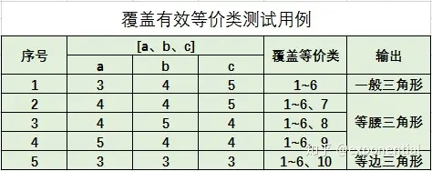
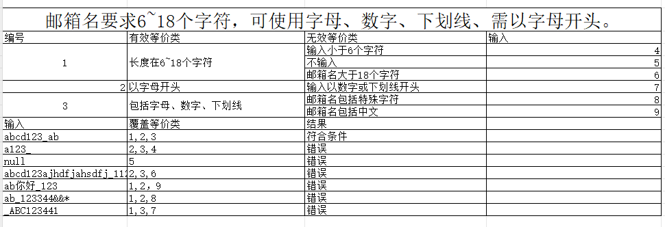

# 测试理论

### 测试基础理论

###### **软件测试模型:**

    W测试模型:  
    需求分析（需求测试）-->详细设计(详细设计测试)-->编码实现(开发单元测试)-->模块集成(模块集成测试)-->系统实时与构建(系统测试)-->交付运行(验收测试)-->文档归档
    V测试模型:  
    需求分析-->编写测试文档-->详细设计-->编写详设文档-->编写用例-->编码开发-->用例执行-->系统集成-->集成测试-->测试报告-->验收-->文档归档
    敏捷测试原则:
    1、持续集成;CI/CD（代码管理,代码扫描,自动构建,自动部署,环境管理,自动化测试（单元测试,集成测试）,部署反馈,线上监控）
    2、自动化测试（接口测试,e2e测试）;
    3、快速反馈;
    4、尽早参与测试;
    5、精准测试；依赖于测试人员和开发人员的业务熟悉程度;
    6、基础设施完善,工具链完善;
    7、精简流程的情况下，符合约束;

###### **测试分类：**

    黑盒测试:
    概念:仅关注输入输出,不关心内部构造;检查功能是否满足产品需求; 
    黑盒测试的常用方法有
    1.边界值分析
    2.等价类划分
        等价类划分是通过prd需求说明文档,所谓的等价类是产品说明的一个子集合;  
        等价类关注输入和输入值域;  
        使用等价类划分的好处,可以使用最少的错误数据覆盖最高的测试范围,性价比高,更类似于精准测试;
    3.因果图-可生成判定表  
    输入输出有对应关系或者组合关系;
       1、列出原因;
       2、列出结果;
       3、列出中间状态;
      再去画出对应的因果图; 
    基本关系符号：
    恒等:若原因出现，则结果出现；若原因不出现，则结果不出现;
    非:若原因出现，则结果不出现；若原因不出现，则结果出现;
    或:若几个原因中有一个出现，则结果出现；若几个原因均不出现，则结果不出现;
    与:若几个原因都出现，结果才出现；若几个原因中有一个不出现，则结果不出现;
    E(互斥、排他):a、b两个原因不会同时出现，最多只有一个出现;
    I(包含、或)：a、b、c三个原因至少有一个出现;
    O(唯一)：a、b两个原因必须有一个出现，且仅有一个出现;
    R(需求)：a出现时b必定出现;

    4.错误推测
    5.探索性测试
    6.判定表法  
    7.正交设计

**等价类划分举例:
是否构成三角形:**

**邮箱名要求6~18个字符，可使用字母、数字、下划线、需以字母开头。**  

##### 缺陷的生命周期:

新建-->指派-->是否是bug，是-->修复-->是否修复完成-->完成关闭   
新建-->指派-->是否是bug，不是-->打回-->关闭  
新建-->指派-->是否是bug，是-->是否修复-->不修复-->当前项目不处理  
新建-->指派-->是否是bug，是-->修复-->是否修复完成-->否-->重新打开

##### **测试类型划分如图所示**:

##### **购物车功能案例设计:**

* 商品成功添加到购物车
* 商品页面跳转到购物车成功，且购物车内的数量与添加时一致
* 商品数量不足时添加到购物车失败
* 购物车界面为空时可以正常查看
* 购物车界面可以修改商品数量
* 购物车界面可以删除商品
* 购物车界面可以批量删除商品
* 修改商品数量超过库存时提示用户
* 购物车界面使用红包或者优惠券
* 购物车界面使用无效的优惠券或者红包时提示用户
* 购物车界面支持单商品结算
* 购物车界面支持多商品结算
* 购物车界面搜索功能
* 购物车界面已加入的商品可以正常跳转访问
* 购物车界面已下架的商品不可修改数量，不可结算，可移除可跳转
* 购物车跳转结算页面正常，且携带过来的数据准确无误

#### **发红包测试案例设计**

* 红包金额校验
* 红包数量校验
* 红包附言校验
* 确定后账户未实名
* 确定后正常弹出支付密码界面
* 支付密码正确/支付密码错误
* 支付成功，红包正常发出
* 密码输入成功后账户余额不足
* 红包领取成功状态显示
* 红包领取明细显示
* 红包过期后红包状态显示
* 红包过期后金额退回，关联明细账单显示
* 发红包成功后明细在账单显示

#### 数据迁移怎么做的数据比对？

1. 主要是用的python脚本,环境3.6.8，引入了request库，idm—db，pymysql，pandas
2. 在cbs7系统内配置银行接口环境；直接写入数据库后，调用9091普通管理员用户清理缓存
3. csv表格文档内填写好这次要配置测试的银行版本，信息包括银行接口类型，银行版本，银行类型，银行接口名称，开户行名称
4. pd.read_csv读取表格内容后，拿到对应的配置信息做配置
5. faker生成银行账户+开户名，登记在系统内
6. 调用新增协议接口进行新增操作；
7. 调用迁移平台进行迁移；
8. 迁移完成后，查两个表内字段的内容，不对的打印出来，存字典，做比对，sql查询as字段名
9. 新系统手工维护信息
10. 触发支付指令查询对不对

#### **你们数据迁移怎么测试点和难点在哪里？**

1. 数据迁移后是否一致
2. 数据库表字段是否符合业务要求
3. 迁移后的业务在新系统能否正常使用
4. 符合条件的迁移数据
5. 迁移失败处理策略

#### **支付模块测试点?**

* 用户功能权限
* 支付单据信息(支付要素类填写是否符合规范),用户数据权限
* 资金监控,涵盖大额资金监控，支付频率监控，重复支付监控，反洗钱预警等
* 关联内部户(内部户资金占用，支付失败资金占用释放，内部户明细勾兑等)
* 关联资金预算(超预算，预算占用，预算勾兑，支付状态变更后的预算状态变更)
* 支付后的明细对账单
* 支付状态流转
* 批量支付
* 涉及改动的接口是否影响erp或者openapi接口
* 关键节点的消息通知是否正常展示

#### **测试用例覆盖怎么保证完善？/关联版本质量问题**

需求覆盖：确保测试用例覆盖了所有的功能需求或者用户故事，涵盖主要功能，边界条件，流转状态，异常情况;
条件覆盖：针对开发详设的每一条分支节点确保涉及的功能案例可以覆盖；
功能覆盖：确保测试用例不仅覆盖到了新需求，还应该覆盖度到原有模块的子功能和前端交互场景，以及关联模块的功能；
兼容性覆盖：不同的浏览器，内核版本，操作系统，设备类型的兼容性覆盖；

#### **线上质量监控**

* 日志监控，每日扫描异常日志，日志内的关键字，excepttion或者消息无限重投
* xxl-job定时任务监控，所有定时任务执行结果扫描
* 服务器硬件使用情况监控
* 核心业务流程自动化回归
* 配置业务文件变动nacos监控

#### **银企直连测试点？**

* 业务指令到直连直连再上送无误
* 业务层到直连，直连到cbc报文协议转换无误，字段传送无误
* cbs过来的业务所走的路由准确无误（由报文模板和银行接口个性化参数确定）
* 直联模块相关涉及到的定时任务准确执行无误（涵盖定时支付、查支付、查明细、查余额、查电子回单，账户信息等）
* 日终备份正常（当日明细迁移到历史明细，当日电子回单迁移到历史电子回单，还有一些支付指令相关的处理）

#### **数据迁移过程中，你是如何确保数据的完整性和一致性的？**

1. 数据备份：在迁移开始之前，对源数据进行完整备份，以便在迁移过程中出现问题时可以恢复数据。
2. 数据验证：预迁移验证：在迁移前，对源数据进行验证，确保数据的准确性和完整性。这可能包括检查数据格式、数据类型、数据量和数据关系等。
3. 迁移后验证：在数据迁移完成后，对目标系统中的数据进行验证，确保数据与源系统中的数据一致。这可以通过比较数据记录、数据结构和数据关系来完成。
4. 集成测试：测试整个迁移流程，确保所有组件和步骤协同工作，数据正确迁移。
5. 性能测试：测试迁移过程的性能，确保迁移不会对系统性能产生负面影响。
6. 数据一致性检查： 使用数据一致性检查工具或编写自定义脚本来比较源数据和目标数据的一致性。这可能包括检查数据的完整性、数据的逻辑关系和数据的业务规则。
7. 数据迁移监控： 在迁移过程中实时监控数据迁移的状态，及时发现并解决迁移过程中的问题。
8. 回滚计划：制定详细的回滚计划，以便在迁移失败或数据不一致时能够迅速恢复到迁移前的状态。

#### ** 你们的支付结算模块的测试点是怎么样设计的可以简单介绍一下吗? **

* 首先是功能菜单权限校验
* 其次是支付要素和数据权限校验，比如付款账户的数据权限
* 如果关联涉及其他模块，若关联内部户则会有内部户相关校验，如果有预算则有预算模块相关校验，除此之外还有重复支付等；
* 如果支持批量导入，则应该校验excel模板，和导入后的字段校验;
* 如果关联涉及支付监控，则可能还会有支付频率监控、 大额支付、反洗钱监控等;
* 支付结算单申请完成后，支付申请界面验证对应的测试数据是否一致;
* 其次再试审批流的验证;包括审批通过、拒绝、打回、退回到某一节点;
* 再是验证整个的支付状态流转是否准确无误;中间可能会有退票，支付失败，如若发生，前面的占用的预算，内部户口金额需要验证是否释放通过;
* 支付成功后，若关联核算模块，则需要验证核算单的生成是否准确无误；结算单据所有状态，数据展示准确无误;
* 其中产生的支付流程和关键节点，主界面是否有消息通知或者短信通知;

#### ** 给一个内部信贷的需求你会如何设计测试点？ **

* 仍然是功能菜单权限的校验
* 其次是界面贷款要素的校验以及对应的数据权限;
* 贷款的话可能会涉及到计息方式，不同的计息方式在申请完贷款后可能需要去验证一下产生的利息是否准确
* 正常经办可以提交成功
* 对应的审批流，审批通过前，是否可以针对该贷款申请单据进行修改，修改界面哪些要素是无法进行修改的
* 贷款审批通过后，是否会触发银行交易，如果产生，应该也会有一个完整的放款流程;
* 贷款审批通过产生的贷款单或是合同号数据是否准确无误;
* 如遇还款日，系统界面是否能够正常触发消息提醒;

#### **你们的复盘会议是如何组织进行的？**

1.简单陈述问题背景，影响范围，严重程度，缺陷根因;  
2.时间线回顾，从问题发现到解决，列出关键事件，关键任务;  
3.根本原因分析，是人为失误，还是需求变更，还是漏测等;  
4.解决方案和改进措施，并指定改进人和时间节点;  
5.持续跟踪该缺陷执行情况;
