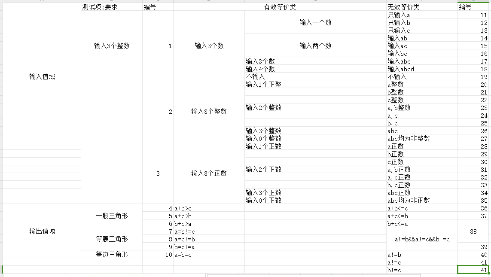
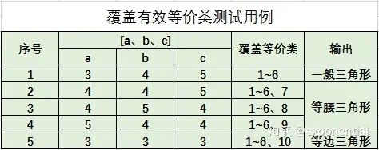
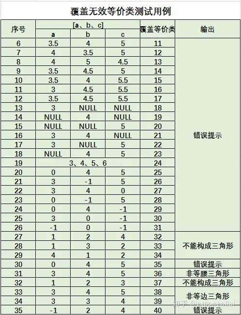
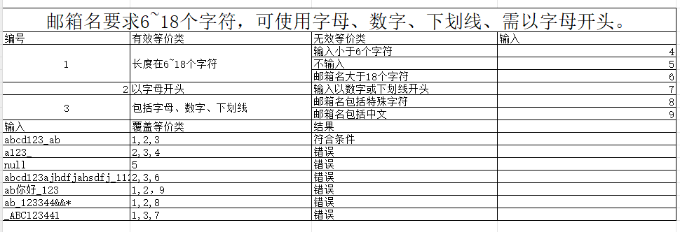
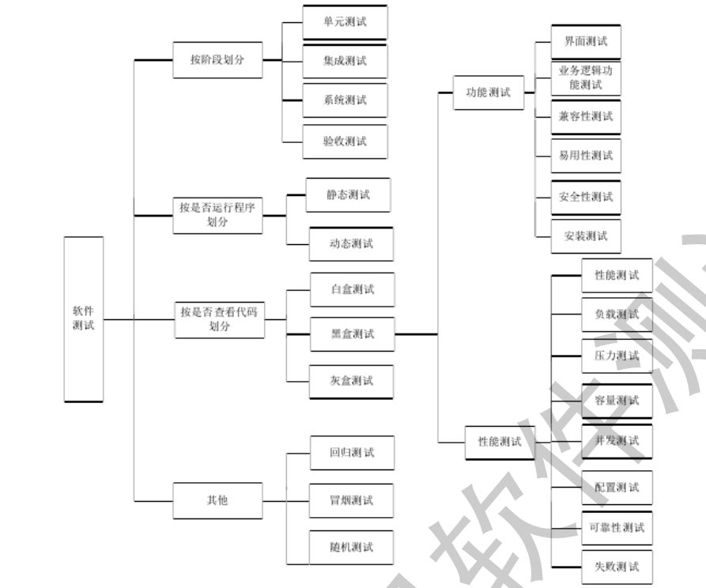

# 测试理论

### 测试基础理论

###### **软件测试模型:**

    W测试模型:  
    需求分析（需求测试）-->详细设计(详细设计测试)-->编码实现(开发单元测试)-->模块集成(模块集成测试)-->系统实时与构建(系统测试)-->交付运行(验收测试)-->文档归档
    V测试模型:  
    需求分析-->编写测试文档-->详细设计-->编写详设文档-->编写用例-->编码开发-->用例执行-->系统集成-->集成测试-->测试报告-->验收-->文档归档
    敏捷测试原则:
    1、持续集成;CI/CD（代码管理,代码扫描,自动构建,自动部署,环境管理,自动化测试（单元测试,集成测试）,部署反馈,线上监控）
    2、自动化测试（接口测试,e2e测试）;
    3、快速反馈;
    4、尽早参与测试;
    5、精准测试；依赖于测试人员和开发人员的业务熟悉程度;
    6、基础设施完善,工具链完善;
    7、精简流程的情况下，符合约束;

###### **测试分类：**

    黑盒测试:
    概念:仅关注输入输出,不关心内部构造;检查功能是否满足产品需求; 
    黑盒测试的常用方法有
    1.边界值分析
    2.等价类划分
        等价类划分是通过prd需求说明文档,所谓的等价类是产品说明的一个子集合;  
        等价类关注输入和输入值域;  
        使用等价类划分的好处,可以使用最少的错误数据覆盖最高的测试范围,性价比高,更类似于精准测试;
    3.因果图-可生成判定表  
    输入输出有对应关系或者组合关系;
       1、列出原因;
       2、列出结果;
       3、列出中间状态;
      再去画出对应的因果图; 
    基本关系符号：
    恒等:若原因出现，则结果出现；若原因不出现，则结果不出现;
    非:若原因出现，则结果不出现；若原因不出现，则结果出现;
    或:若几个原因中有一个出现，则结果出现；若几个原因均不出现，则结果不出现;
    与:若几个原因都出现，结果才出现；若几个原因中有一个不出现，则结果不出现;
    E(互斥、排他):a、b两个原因不会同时出现，最多只有一个出现;
    I(包含、或)：a、b、c三个原因至少有一个出现;
    O(唯一)：a、b两个原因必须有一个出现，且仅有一个出现;
    R(需求)：a出现时b必定出现;

    4.错误推测
    5.探索性测试
    6.判定表法  
    7.正交设计

**等价类划分举例:
是否构成三角形:**




**邮箱名要求6~18个字符，可使用字母、数字、下划线、需以字母开头。**  


##### 缺陷的生命周期:

新建-->指派-->是否是bug，是-->修复-->是否修复完成-->完成关闭   
新建-->指派-->是否是bug，不是-->打回-->关闭  
新建-->指派-->是否是bug，是-->是否修复-->不修复-->当前项目不处理  
新建-->指派-->是否是bug，是-->修复-->是否修复完成-->否-->重新打开

##### **测试类型划分如图所示**:



##### **购物车功能案例设计:**

* 商品成功添加到购物车
* 商品页面跳转到购物车成功，且购物车内的数量与添加时一致
* 商品数量不足时添加到购物车失败
* 购物车界面为空时可以正常查看
* 购物车界面可以修改商品数量
* 购物车界面可以删除商品
* 购物车界面可以批量删除商品
* 修改商品数量超过库存时提示用户
* 购物车界面使用红包或者优惠券
* 购物车界面使用无效的优惠券或者红包时提示用户
* 购物车界面支持单商品结算
* 购物车界面支持多商品结算
* 购物车界面搜索功能
* 购物车界面已加入的商品可以正常跳转访问
* 购物车界面已下架的商品不可修改数量，不可结算，可移除可跳转
* 购物车跳转结算页面正常，且携带过来的数据准确无误

#### **发红包测试案例设计**

* 红包金额校验
* 红包数量校验
* 红包附言校验
* 确定后账户未实名
* 确定后正常弹出支付密码界面
* 支付密码正确/支付密码错误
* 支付成功，红包正常发出
* 密码输入成功后账户余额不足
* 红包领取成功状态显示
* 红包领取明细显示
* 红包过期后红包状态显示
* 红包过期后金额退回，关联明细账单显示
* 发红包成功后明细在账单显示

####  数据迁移怎么做的数据比对？

1. 主要是用的python脚本,环境3.6.8，引入了request库，idm—db，pymysql，pandas
2. 在cbs7系统内配置银行接口环境；直接写入数据库后，调用9091普通管理员用户清理缓存
3. csv表格文档内填写好这次要配置测试的银行版本，信息包括银行接口类型，银行版本，银行类型，银行接口名称，开户行名称
4. pd.read_csv读取表格内容后，拿到对应的配置信息做配置
5. faker生成银行账户+开户名，登记在系统内
6. 调用新增协议接口进行新增操作；
7. 调用迁移平台进行迁移；
8. 迁移完成后，查两个表内字段的内容，不对的打印出来，存字典，做比对，sql查询as字段名
9. 新系统手工维护信息
10. 触发支付指令查询对不对

#### **你们数据迁移怎么测试点和难点在哪里？**

1. 数据迁移后是否一致
2. 数据库表字段是否符合业务要求
3. 迁移后的业务在新系统能否正常使用
4. 符合条件的迁移数据
5. 迁移失败处理策略

#### **支付模块测试点?** 
* 用户功能权限
* 支付单据信息(支付要素类填写是否符合规范),用户数据权限
* 资金监控,涵盖大额资金监控，支付频率监控，重复支付监控，反洗钱预警等
* 关联内部户(内部户资金占用，支付失败资金占用释放，内部户明细勾兑等)
* 关联资金预算(超预算，预算占用，预算勾兑，支付状态变更后的预算状态变更)
* 支付后的明细对账单
* 支付状态流转
* 批量支付
* 涉及改动的接口是否影响erp或者openapi接口
* 关键节点的消息通知是否正常展示

####  **测试用例覆盖怎么保证完善？/关联版本质量问题**

需求覆盖：确保测试用例覆盖了所有的功能需求或者用户故事，涵盖主要功能，边界条件，流转状态，异常情况;
条件覆盖：针对开发详设的每一条分支节点确保涉及的功能案例可以覆盖；
功能覆盖：确保测试用例不仅覆盖到了新需求，还应该覆盖度到原有模块的子功能和前端交互场景，以及关联模块的功能；
兼容性覆盖：不同的浏览器，内核版本，操作系统，设备类型的兼容性覆盖；

####  **线上质量监控**

* 日志监控，每日扫描异常日志，日志内的关键字，excepttion或者消息无限重投
* xxl-job定时任务监控，所有定时任务执行结果扫描
* 服务器硬件使用情况监控
* 核心业务流程自动化回归
* 配置业务文件变动nacos监控

#### **银企直连测试点？**

* 业务指令到直连直连再上送无误
* 业务层到直连，直连到cbc报文协议转换无误，字段传送无误
* cbs过来的业务所走的路由准确无误（由报文模板和银行接口个性化参数确定）
* 直联模块相关涉及到的定时任务准确执行无误（涵盖定时支付、查支付、查明细、查余额、查电子回单，账户信息等）
* 日终备份正常（当日明细迁移到历史明细，当日电子回单迁移到历史电子回单，还有一些支付指令相关的处理）


#### **Jenkins构建流程？**
* Jenkins基本设置；管理员账户设置，系统基本设置，安装必要的插件;
* 创建Jenkins job组
* 创建pipline；
* 配置源代码管理工具，git或者svn，还有账号，代码库；
* 配置触发器，通知服务
* 编写构建脚本;
* 构建测试
* 如果有需要可以设置远程执行机

#### **数据迁移过程中，你是如何确保数据的完整性和一致性的？**
1. 数据备份：在迁移开始之前，对源数据进行完整备份，以便在迁移过程中出现问题时可以恢复数据。
2. 数据验证：预迁移验证：在迁移前，对源数据进行验证，确保数据的准确性和完整性。这可能包括检查数据格式、数据类型、数据量和数据关系等。
3. 迁移后验证：在数据迁移完成后，对目标系统中的数据进行验证，确保数据与源系统中的数据一致。这可以通过比较数据记录、数据结构和数据关系来完成。
4. 集成测试：测试整个迁移流程，确保所有组件和步骤协同工作，数据正确迁移。
5. 性能测试：测试迁移过程的性能，确保迁移不会对系统性能产生负面影响。
6. 数据一致性检查： 使用数据一致性检查工具或编写自定义脚本来比较源数据和目标数据的一致性。这可能包括检查数据的完整性、数据的逻辑关系和数据的业务规则。
7. 数据迁移监控： 在迁移过程中实时监控数据迁移的状态，及时发现并解决迁移过程中的问题。
8. 回滚计划：制定详细的回滚计划，以便在迁移失败或数据不一致时能够迅速恢复到迁移前的状态。


#### ** 你们的支付结算模块的测试点是怎么样设计的可以简单介绍一下吗? **
* 首先是功能菜单权限校验
* 其次是支付要素和数据权限校验，比如付款账户的数据权限
* 如果关联涉及其他模块，若关联内部户则会有内部户相关校验，如果有预算则有预算模块相关校验，除此之外还有重复支付等；
* 如果支持批量导入，则应该校验excel模板，和导入后的字段校验;
* 如果关联涉及支付监控，则可能还会有支付频率监控、 大额支付、反洗钱监控等;
* 支付结算单申请完成后，支付申请界面验证对应的测试数据是否一致;
* 其次再试审批流的验证;包括审批通过、拒绝、打回、退回到某一节点;
* 再是验证整个的支付状态流转是否准确无误;中间可能会有退票，支付失败，如若发生，前面的占用的预算，内部户口金额需要验证是否释放通过;
* 支付成功后，若关联核算模块，则需要验证核算单的生成是否准确无误；结算单据所有状态，数据展示准确无误;
* 其中产生的支付流程和关键节点，主界面是否有消息通知或者短信通知;


#### ** 给一个内部信贷的需求你会如何设计测试点？ **
* 仍然是功能菜单权限的校验
* 其次是界面贷款要素的校验以及对应的数据权限;
* 贷款的话可能会涉及到计息方式，不同的计息方式在申请完贷款后可能需要去验证一下产生的利息是否准确
* 正常经办可以提交成功
* 对应的审批流，审批通过前，是否可以针对该贷款申请单据进行修改，修改界面哪些要素是无法进行修改的
* 贷款审批通过后，是否会触发银行交易，如果产生，应该也会有一个完整的放款流程;
* 贷款审批通过产生的贷款单或是合同号数据是否准确无误;
* 如遇还款日，系统界面是否能够正常触发消息提醒;


#### **你们的复盘会议是如何组织进行的？**
1.简单陈述问题背景，影响范围，严重程度，缺陷根因;  
2.时间线回顾，从问题发现到解决，列出关键事件，关键任务;  
3.根本原因分析，是人为失误，还是需求变更，还是漏测等;  
4.解决方案和改进措施，并指定改进人和时间节点;  
5.持续跟踪该缺陷执行情况;

# python基础 

https://github.com/EighteenWu/python_study/blob/main/unit2/%E7%AC%AC%E4%BA%8C%E7%AB%A0%E8%8A%82%E7%AC%94%E8%AE%B0.md  
参考 python基础那一块的知识点~  
常见简单问题:

##### 1、字符串反序输出?

```python
print(str[::-1])


# 第二种方法
def reverse_string(s):
 for i in range(len(s) - 1, -1, -1):
  print(s[i], end='')


# 递归输出
def reverse_string_recursive(s):
 if len(s) == 0:
  return s
 else:
  return reverse_string_recursive(s[1:]) + s[0]
```

##### 2、斐波那契数列求N？

```python
N = int(input("请输入N的值:"))
# 定义一个列表
fib = [0 for x in range(N + 1)]
fib[0] = 0
fib[1] = 1
for i in range(2, N + 1):
 fib[i] = fib[i - 1] + fib[i - 2]
print(fib[N])


# 方法2
def feb(n):
 curr, pred = 0, 1
 k = 0
 while k < n:
  curr, pred = pred, curr + pred
  k += 1
 return curr


print(feb(10))

```

#### 3、判断回文?

```python
str_a = 'abcd'
if str_a == str_a[::-1]:
 print(True)
```

# python进阶

#### **说说什么是装饰器，你用过哪些装饰器？**

装饰器是一种设计模式，主要用于不修改已有功能的基础上扩展或增强已有功能。它是一种高阶函数，接受一个函数作为入参
并返回一个新的函数;一般情况下用pytest的装饰器比较多，比如@pytest.fixture，@pytest.mark.parametrize,@pytest.skip标记等

```python
# 装饰器示例
# 记录函数运行时间
def run_time(func):
 import time
 def wrapper(*args, **kwargs):
  start_time = time.time()
  result = func(*args, **kwargs)
  end_time = time.time()
  print(f'{func.__name__} run_time: {end_time - start_time}s')
  return result

 return wrapper


@run_time
def sum_a():
 # 计算1-10000000000的和
 sum = 0
 for i in range(10000000):
  sum += i
 print(sum)
```

#### **python内的魔术方法有哪些，简单介绍一下**
python中有很多魔术方法，一般也称为双下划线方法，我知道的有以下几种  
* **`__init__`** 构造方法，创建一个类时被调用，用于初始化方法
* **`__new__`** 在实例创建前被调用，用于创建实例，是类级别的方法，创建并返回一个新的对象实例，
* **`__str__`** 显示对象时调用，返回对象的字符串表示
* **`__repr__`** 当使用repr()函数时调用，或者在交互式解释器中显示对象时调用，通常应该返回一个可以用来重建对象的字符串
* **`__len__`** 获取对象长度时调用，返回对象的长度
* **`__getitem__`** 当使用下标访问（如obj[key]）时调用

#### **请问__new__和__init__有什么区别？
`__new__`方法用于创建一个实例，是类级别的方法,方法通常用于控制实例的创建过程，尤其在继承不可变类型(如`int`,`str`,`tuple`)或者需要自定义实例创建逻辑时
```python
class Test:
    def __new__(cls, *args, **kwargs):
        print('__new__')
        return super().__new__(cls)

    def __init__(self):
        print('__init__')
```
**区别** 
* 调用时机
    * `__new__` 在实例创建前被调用
    * `__init__` 在实例创建后被调用，用于初始化实例
* 返回值
  * `__new__` 返回一个新的实例对象
  * `__init__` 不返回任何值，只负责初始化实例
* 参数
  * `__new__`的第一个参数是类本身，后面是传入的参数
  * `__init__`第一个参数是实例本身，表示正在初始化的实例

#### **python中有switch-case模式匹配吗，如果没有，如何实现？**
没有一模一样的语句，但是有math-case语句，需要python版本大于3.10,样例如下
```python
# math-case
def switch_case(x):
    match x:
        case 1:
            print('case 1')
        case 2:
            print('case 2')
        case 3:
            print('case 3')
        case _:
            print('default')
```
使用其他方式实现switch-case，我这边有两个方法
```python
# 实现switch-case 例子1，使用if-else
def switch_case(x):
    if x == 1:
        print('case 1')
    elif x == 2:
        print('case 2')
    elif x == 3:
        print('case 3')
    else:
        print('default')


# 实现swit-case例子2，使用字典映射
def switch_case_2(x):
    cases = {
        1: 'case 1',
        2: 'case 2',
        3: 'case 3',
        'default': 'default'
    }
    print(cases.get(x, cases['default']))
```


# pytest

1、pytest运行用例？  
A: pytest -s filename; [显示详细信息]  
2、pytest测试用例格式?  
A: 测试文件以test_*.py或者*_test.py结尾;测试用例以test开头的函数;测试类也是用Test开头的类名;  
3、Fixtures:

* 用于设置测试前的环境或者初始化数据,以及测试后的清理工作;
* 通过装饰器@pytest.fixture来标记，并通过函数参数注入到用例中;

```python
import pytest


@pytest.fixture
def input_value():
    return 38


def test_divisible_by_19(input_value):
    assert input_value % 19 == 0

```

4、参数化测试?  
使用@pytest.mark.parameter装饰器来实现用例参数化；

```python
import pytest


@pytest.mark.parametrize("a, b, expected", [
 (1, 2, 3),
 (4, 5, 9),
 (10, 20, 30)
])
def test_add(a, b, expected):
 assert a + b == expected

```

5、标记(Marking):
使用@pytest.mark装饰器打用例标记;

6、跳过用例:

```python
import pytest


@pytest.mark.skip(reason="跳过原因")
def test_example():
 assert True
```

7、运行特定的测试用例?  
使用命令pytest -k "测试用例名称"

8、pytest-fixture使用夹具:

```python
import pytest


# 定义一个fixture，用于准备测试数据
@pytest.fixture
def data():
 data = [1, 2, 3, 4, 5]
 return data


# 使用fixture进行测试
def test_sum(data):
 result = sum(data)
 assert result == 15
```

9、 说下你们公司的自动化框架的项目结构？

```python
# 业务组件封装
--aw
    --payment
        payment_commont.py
    --c1_task
    --account
    --finaching
    --commmon
        db.py
        auth.py
    --...
#配置文件
--conf
    --sys
        payment.yaml
        account.yaml
    default.yaml
    payment.yaml
    xxx.yaml
--report
    --xxx.html
# 测试案例
--script
    --payment
        --payment_202_test.py
        --payment_202_test.xlsx
        --payment_202_test.yaml
    --...
test.py
# 工具项
--utils
    --gen_case.py
    --notify.py
```

# selenium

1、webdriver原理？

* 每个 Selenium 命令，这里指的是所谓的基础操作，例如，点击、输入等，都会创建一条 HTTP 请求，
* 发送给 Browser WebDriver
* Browser WebDriver 使用一个 HTTP Server 监听和接收 HTTP 请求
* HTTP Server 根据协议规则定义这些 Selenium 命令对应的浏览器具体操作
* 浏览器执行这些操作
* 浏览器将执行状态返回给 HTTP Server
* HTTP Server 再将这些状态信息返回给自动化脚本

2、selenium定位方式?

1. id
2. class
3. name
4. 标签
5. css选择器
6. xpath选择器
7. 超链接文本(精准匹配)
8. 超链接文本（模糊匹配）

3、使用优先级  
如果有id优先用id，没有id优先用name属性，在没有的话用css选择器，或者xpath选择器;

4、如果定位不到元素怎么办？
首先看是不是脚本问题，没有加载出来或者遮挡，然后再去看看存不存在dom树上，用css或者xpath绝对路径定位下，实在不行用调用js执行
getElementBy方法定位;

5、显示等待和隐式等待以及固定等待？

```python
import time
from selenium import webdriver
from selenium.webdriver.support.ui import WebDriverWait
from selenium.webdriver.support import expected_conditions as EC

# 固定等待
time.sleep(3)

webdriver = webdriver.chrome()

# 显示等待
WebDriverWait(webdriver, 4).until(EC.visibility_of_element_located(locator))

# 隐式等待
webdriver.implicitly_wait(20)

```

# 性能测试

1、性能指标有哪些？  
**响应时间:**

* 平均响应时间
* 最大响应时间
* 最小响应时间
* 百份位响应时间，即多少百分比的请求在多少时间范围内完成

**吞吐量:**  
在单位时间内处理的请求数qps，或者每秒处理的事务数tps  
**并发用户数：**  
同时处理的用户数  
**资源利用率:**

* cpu利用率
* 内存利用率
* 磁盘io利用率
* 网络带宽利用率

**事务成功率:**  
成功完成的事务数占总事务的比例;  
**错误率（Error Rate）：**
定义：系统在处理请求时发生错误的比例。  
**延迟（Latency）：**
定义：请求在系统内传输的时间，也称为等待时间或延迟时间。   
**峰值负载（Peak Load）：**
定义：系统能够承受的最大负载。  
**吞吐量与响应时间关系（Throughput vs. Response Time）：**
定义：系统在不同负载下的吞吐量与响应时间的关系。  
**用户体验度量（User Experience Metrics）：**
页面加载时间（Page Load Time）：页面从开始加载到完全加载的时间。

### Jmeter 工具

**1、 Jmeter常用组件有哪些？**

* **TestPlan**[测试计划]
* **Threads**[线程用户] 包括tearDown、setUp、线程组;
* **测试片段**[Test Fragement]
* **取样器**[Sampler]包括http、tcp、udp、beanshell等~
* **逻辑控制器**[Logic Controller]主要是if、while、switch、for
* **配置元件**[config element]一些参数化的东西，http请求头用户认证、cookie管理器等
* **定时器**[timer]  固定定期器、随机定时器
* **前置处理器**[Per Processors]数据库链接预处理程序,beanshell预处理程序
* **后置处理器**[Post Processors]提取response相应数据,jsonpath,xpath,正则表达断言器
* 、**断言**[Assertions]断言预期结果i,jsonpath,xmlpath
* 、**监听器**[lisener]测试结果统一汇总,报告生成 ,有聚合报告，结果树,汇总图

大概流程:
测试计划-->线程组-->配置原件-->定时器-->前置处理器-->采样器-->后置处理器-->断言-->监听器

**2、性能测试流程？**
**制定测试计划**
* 确定性能测试的目标，如系统最大负载，响应时间、吞吐量、90%用户响应时间等
* 确定性能测试需求的范围和优先级，具体涉及到哪些业务流，哪些功能模块
* 测试资源规划，需要的测试环境，硬件配置，数据库配置等等
* 确定测试工具和测试方法；

**性能测试执行**
* 根据实际的需求场景编写测试用例,涵盖前置条件，步骤，预期结果,测试数据
* 配置测试环境，确定性能测试环境与生成环境尽量保持一致，或者能够进行数据对比
* 构造测试数据
* 编写测试脚本
* 代码提交前原环境预执行，代码提交后再次执行；方便比对结果
* 监控和收集测试数据

**测试结果分析及优化和卡点测试**
* 分析结果
* 输出测试报告
* 未达标执行回归测试
* 预投产测试和上线测试

**3、QPS（每秒请求数）和TPS（每秒事务处理数有什么区别）?**  
**QPS（Queries Per Second):**  
_QPS_ 表示在每秒系统能够处理的查询次数，通常用于数据库系统、搜索引擎、wbb网站处理请求的能力，**是独立的请求次数**;  
比如搜索引擎点击一下搜索，触发了一个请求，那么只算为一次请求;比如我打开一个页面可能触发了6个请求，那就是6个请求;
则1秒内10用户同时打开了页面，则QPS为10*6=60 QPS；  
**TPS (ransactions Per Second)**  
_TPS_ 表示的是每秒钟系统能够处理的事务数，比如支付转账，完整的支付转账流程为，查询付方账户在系统内登记，查询账户可用余额，查询业务系统参数，查询
收款账户历史保存信息，转账成功；针对我们系统来说这算一次事务；那么我1分钟内最大可以支持60笔支付；那么其tps就是1;


**4、Jmeter如何使用时间戳，除此之外你还知道哪些其他常用的函数?**
```commandline
# 时间戳
${__time(,)}
${__time(MM/dd/yyyy HH:mm:ss,)
# 随机数
${__Random(1,100,)}
# 计数器
${__counter()}
# 随机长度字符串
${__RandomString(20,)}
```

**5、Jmeter多个线程组之间如何引用/共享其他线程的变量?**  
a.使用属性（Properties），JMeter的属性是全局的，可以在所有线程之间共享。你可以使用__setProperty()函数设置属性，然后使用__property()或__P()函数在其他线程中获取这个属性。
```commandline
#在一个线程中设置属性
${__setProperty(myProperty,myValue,)}
# 在另外一个线程中获取属性
${__property(myProperty,default_value,)}
```
b.使用JMeter的__threadGroup()函数,从JMeter 5.0开始，你可以使用__threadGroup()函数来引用其他线程组中的变量。这个函数允许你指定一个线程组，然后引用该线程组中的变量。
```commandline
# 某个线程设置变量
vars.put("myVariable","myValue");
# 引用其他线程的变量
${__threadGroup(Thread Group Name,current).getVariable("myVariable")}
```

# 数据库基础

1、什么是数据库?

A：根据**数据结构**来**组织**、**存储**、**管理数据**的仓库;

2、什么是关系型数据库,主键、外键、索引分别是什么?  
A:关系数据库是由多张可以互相联结的二位行列表格组成的数据库;  
**主键（primary key）:** 一般是用于表示表内的数据的唯一标识;可以有**一个**或者**多个**;  
**外键**:一般用来表示两个关系之间的相关联系，有外键的的表称为主表的从表,外键又称为关键字;  
**索引**: 索引是一种单独的、物理的对数据库一列或者多列值进行排序的一种存储结构;可以理解为表内数据的集合和相应的表中数据也的逻辑指针清单;

3、表的链接查询方式有哪些？有什么区别？  
A:**交叉链接、内连接、自链接、外链接** todo
4、事务的特性?  
A:**原子性**: 事务中的全部操作在数据库中是不可以被分割的，要么全部完成，要么全部不执行;  
**一致性**: 几个并行执行的事务，其执行结果必须按某一顺序串行执行的结果一致;  
**隔离性**: 事务的执行不受其他的事务的干扰，事务执行的中间结果对其他事务必须是透明的;  
**持久性**: 对于任何已提交事务,系统必须保证事务对该数据库的改变不被丢失,即使数据库出现故障;

5、MySql数据库中怎么实现分页?

```mysql
select *
from tablename
limit 20 offset 10;
#limit后面+限制的条数，offset则是偏移量;
```

6、MySql基本操作?

```mysql
# 创建一个新的数据库
CREATE DATABASE database_name;

# 使用一个特定的数据库
USE database_name;

# 显示当前数据库中的所有表;
show TABLES;

# 创建一个新的表;
CREATE TABLE table_name
(
 name char(20);
age int(3);
gender char(2);
adress char(128);
);

# 插入数据到数据库中
INSERT INTO table_name(cloumn1, cloumn2, cloumn3)
VALUES (value1, value2, value3);

# 查询数据;
SELECT column1, column2, column3
FROM table_name
where condition;

# 更新语句
UPDATE table_name
set columns1 = value1,
    coloumn2 = value2, ...
 WHERE condition;

# 删除数据
DELETE
FROM table_name
where condition;

# 删除一个表
DROP TABLE table_name;

# 删除一个数据库
DROP DATABASE database_name;

# 修改表,修改字段;
ALTER table table_name
 change old_name new_name char not null;

```

7、 Mysql数据类型?

* 整数数类型有 TINYINT:占用一个字节 INT（4字节） BIGINT(大的整数,占用8个字节)SMALLINT，占用两个字节 MEDIUMINT,3个字节
* 浮点数或定点数:FLOAT（单精度浮点数）,DOUBLE（双进度浮点数）,DECIMAL（存储货币使用,定点数)；
* 日期和事件类型:DATA(仅有日期),TIME（仅有时间),DATATIME(包含日期和时间)，TIMESTAMP（自动设置当前日期，用来存储更新时间或者创建时间），YEAR（仅有年份）
* 字符串类型:CHAR(255,定长字符串),VARCHAR(65535,变成字符串),TEXT(文本),LONGTEXT（长文本）,ENUM(枚举类型),SET(
  一个字符串对象);
* 二进制类型:BINARY(存储二进制字符串),BLOB（存储二进制大对象）;
* 其他类型:JSON;

8、常见数据库问题?

```mysql
# Student-Sourse-SC-Teacher 表关系如下
# Student（sid，Sname，Sage，Ssex）学生表
# Course（cid，Cname，tid）课程表
# SC（sid，cid，score）成绩表
# Teacher（tid，Tname）教师表
# 查询课程 001 课程比 002课程成绩高的所有学生的学号？
# 问题1、使用外链接查询+where子句
SELECT sc1.sid
from SC AS sc1
WHERE sc1.cid = '001'
  and sc1.score >
      (select score from SC AS sc2 where sc2.cid = '002');
# 2、使用自链接查询
SELECT sid
from SC sc1
      join SC sc2 ON sc1.sid = sc2.sid
where sc1.cid = '001'
  and sc2.cid = '002'
  AND sc1.score > sc2.score;

# 问题2、修改学号为 20131201 的语文成绩为 100‘
UPDATE SC
SET score = 100
where sid = '20131201'
  and cid = (select cid
             FROM Course
             where Cname = "语文");

# 问题3、 插入一条名为“李四”的教师记录
INSERT INTO Teacher(Tname)
VALUES ("李四");

# 问题4 删除学习叶平老师课程的sc表记录;
DELETE
FROM SC
WHERE cid = (SELECT cid
             From Teacher t1
                   join Course c1 ON t1.tid = c1.tid
             where t1.Tname = "李平")
```

9、上面的题我看到你用Join,LEFT Join, Right Join，请问他们都是什么意思，有什么区别?  
A：Join 内链接,Join通常指的是Inner
Join,只返回链接的两个表中匹配的条件记录。如果左表中的行与右表的行在链接条件上匹配，则返回，如果没有匹配上，则不返回;  
Left Join 左连接,通常指的是返回左表中的所有记录，右表如果没有匹配上则显示为NULL;  
Right Join 右链接，通常指的是返回右表中的所有记录和左表中匹配的记录，如果左表没有匹配就返回NULL值;

```mysql
# 图示说明
INNER JOIN (JOIN):
A:       B:
|---|    |---|
| 1 |    | 1 |
| 2 |    | 3 |
| 3 |    |   |
|---|    |---|
Result:
|---|
| 1 |
| 3 |
|---|

LEFT JOIN:
A:       B:
|---|    |---|
| 1 |    | 1 |
| 2 |    | 3 |
| 3 |    |   |
|---|    |---|
Result:
|---|---|
| 1 | 1 |
| 2 |NULL|
| 3 | 3 |
|---|---|

RIGHT JOIN:
A:       B:
|---|    |---|
| 1 |    | 1 |
| 2 |    | 3 |
| 3 |    |   |
|---|    |---|
Result:
|---|---|
| 1 | 1 |
|NULL| 3 |
| 3 | 3 |
|---|---|

```

# Linux基础

##### 问题归纳

1、如何查看系统版本信息？

```commandline
uname -a
cat /proc/version
```

2、查看ip地址?

```commandline
ifconfig
```

3、查看磁盘剩余空间?

```commandline
df -ah
df 查看系统磁盘剩余指令, a查看所有文件系统,h以可读方式展示(主要是系统容量部分)
```

4、linux操作指令是什么样的规则?

```commandline
common[指令] options[-选项] parameter【参数】
大小写敏感  
无视多少个空格符号
一行指令，换行需要 \反斜杠跳脱
```

5、系统服务管理?

```commandline
service servicename[服务名] operation[操作，比如：restart-重启,start-启动,stop-停止,reload-重新加载配置,status-状态]
```

6、如何查看文件或者目录的大小?

```commandline
du -sh Crontab  
s显示整个目录或者文件的大小
h 可读形势
```

7、如何查看系统中开放的端口号?

```commandline
netstat -tupln
参数翻译:t显示tcp指令,u显示udp，p显示相关程序名，l显示正在监听，n不显示别名;
```

8、动态显示cpu占用?

```commandline
top指令
```

9、查询某个进程占用?

```commandline
ps -aux | grep php
显示php占用
```

10、ls和ll的区别?

```commandline
ls 是指令，显示当前目录下的文件
ll 是自定义指令，可以称为别名，实际是ls -l，以长文件格式化显示权限，所有者，大小
ls -al 显示所有，包括隐藏，link
ls -L 显示链接;
```

11、 系统小程序?

```commandline
nano test.txt  【简单的文本编辑器】
bc  【简单的计算器】
cal 【显示当前月份的日历】
date 【显示当前的日期】
```

12、文件目录权限？

```commandline
linux 系统内文件权限为所有者【owner】、Grup【群组】、other【他人】
新增目录默认权限为755，文件权限为644;
可以使用命令umask更改系统初始新增文件权限;即为所有者可读可写可执行，群组可读可执行，他人可读可执行;
更改权限为chomod 777 filename
更改文件群组为chgrp
更改文件所有者为chown
```

13、新建、复制、移动、删除文件或目录?

```commandline
touch filename 新增文件
mkdir dirname 新增目录
rmdir dirname  删除空目录
rm -rm 删除非空目录
cp root-filename target-flename 复制文件
nv root-file/dir  target-path  移动文件
```

14、查看文件？

```commandline
head -10 filename  查看文件头10行
tail -f filename  动态查看文件
less filename 按屏幕显示
cat filename  截取部分内容显示,后续一般跟着grep
```

15、杀死某个进程?

```commandline
ps -ef | grep 进程名
```

16、解压和压缩？

```commandline
tar -zcvf 压缩 z通过gzip程序压缩或者解压,c表示新的文件归档文件,v详细模式,f表示接下来的选项是文件名
tar -zxvf 解压 x表示提取文件
```

# git使用

#### 1、git rebase和git merage的区别?

A：都是用于合并代码,其中git merage是保留历史提交记录,合并成一个新的分支再去提交,非线性历史;git
rebase是不保留历史节点，线性历史,应用到某个分支;

#### 2、如何更改最近一次的commit信息？

````gitexclude
git commit -amend
````

#### 3、 如何更改已提交合并分支的commit信息？

```gitexclude
1、首先使用git log 查看历史记录和对用分支的哈希值;
git log
2、再使用git rebase变基到目标提交的父提交上
git rebase -i <哈希值>
3、找到对应的提交记录后，讲前面的pick改成edit;
5、运行git commit --amend更改提交信息
6、 git rebase --connitune 继续变基过程;
7、查看代码是否有冲突，手动处理冲突后，git add;然后push就行
```

#### 4、 代码回滚过吗，用的什么指令?

```gitexclude
回滚过，一般用git reset,然后里面有3个模式soft,一般用于撤销提交但保留更改,mixd
重置暂存区,但是保留工作目录中的更更更,hard就是放弃所有的，直接完全回滚到某个历史状态;
```

# 计算机基础